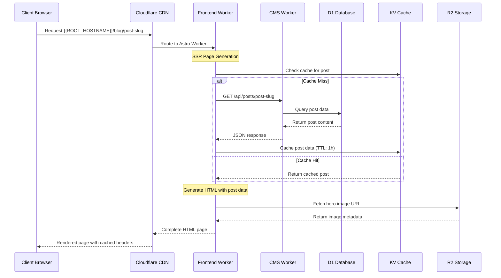
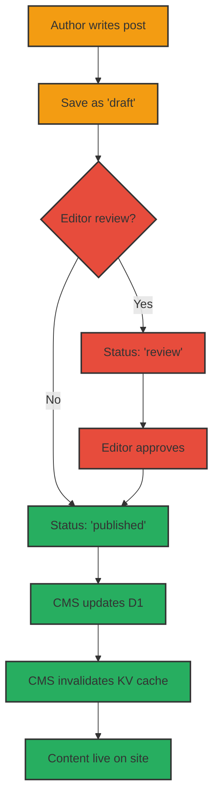

# System Architecture

## High-Level Architecture

```mermaid
graph TB
    %% Client Layer
    Client[fa:fa-desktop Browser Client]
    
    %% Cloudflare Edge Layer
    subgraph "Cloudflare Edge Network"
        CDN[fa:fa-globe CDN/DNS]
        Worker1[fa:fa-cog Astro Frontend Worker<br/>{{ROOT_HOSTNAME}}]
        Worker2[fa:fa-database SonicJS CMS Worker<br/>{{ADMIN_HOSTNAME}}]
    end
    
    %% Storage Layer
    subgraph "Cloudflare Storage"
        D1[(fa:fa-database D1 Database<br/>SQLite)]
        KV[(fa:fa-key KV Store<br/>Content Cache)]
        R2[(fa:fa-cloud R2 Storage<br/>Media Files)]
    end
    
    %% External Services
    subgraph "External"
        GitHub[fa:fa-github GitHub Actions<br/>CI/CD]
        Terraform[fa:fa-sitemap Terraform<br/>Infrastructure]
    end
    
    %% Client Connections
    Client --> CDN
    CDN --> Worker1
    
    %% Worker Connections
    Worker1 --> Worker2
    Worker1 --> KV
    Worker1 --> R2
    Worker2 --> D1
    Worker2 --> KV
    Worker2 --> R2
    
    %% Deployment Connections
    GitHub --> Worker1
    GitHub --> Worker2
    Terraform --> D1
    Terraform --> KV
    Terraform --> R2
    
    %% Styling
    classDef workerClass fill:#ff6b35,stroke:#333,stroke-width:2px,color:#fff
    classDef storageClass fill:#4ecdc4,stroke:#333,stroke-width:2px,color:#fff
    classDef externalClass fill:#95a5a6,stroke:#333,stroke-width:2px,color:#fff
    classDef clientClass fill:#3498db,stroke:#333,stroke-width:2px,color:#fff
    
    class Worker1,Worker2 workerClass
    class D1,KV,R2 storageClass
    class GitHub,Terraform externalClass
    class Client,CDN clientClass
```

## Request Flow



## Content Publishing Flow

